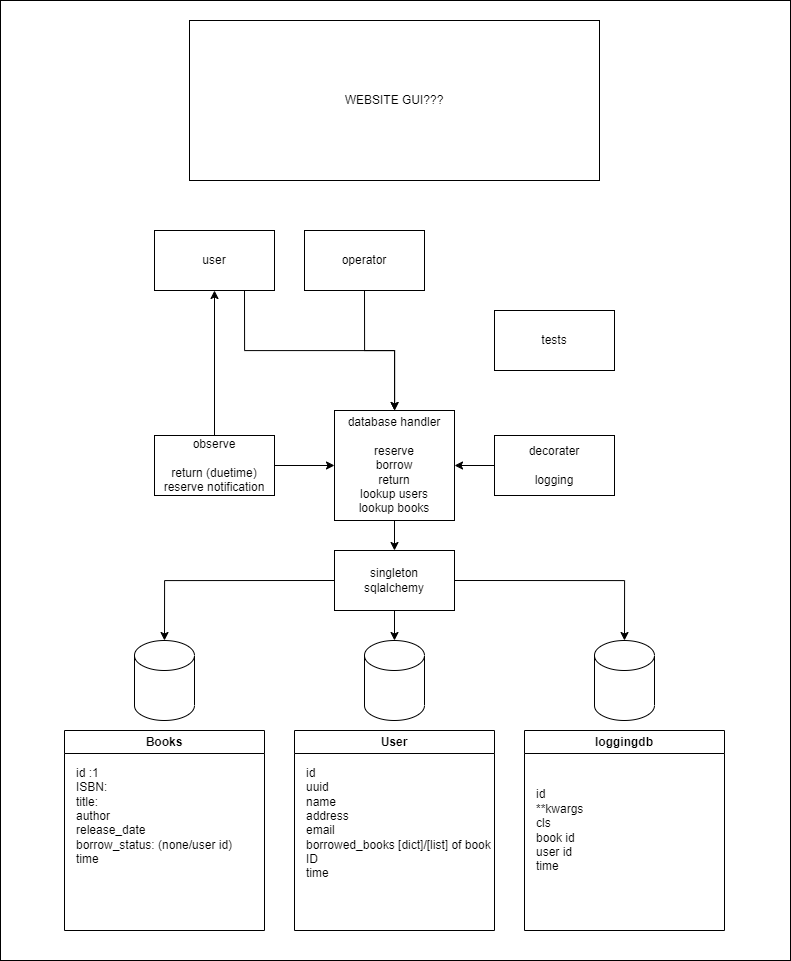

# Library

## Code used
This is the code used for the project. See [Diagrams](#diagrams) for structure
* [Database Tables / Classes](Code/db_class.py)
    * `db_class.py` contains all tables the database will of.
    This is done using a base class from `sqlalchemy` to keep track of SQL related variables.

* [Handler for database calls](Code/handler.py)
    * `handler.py` handles all interaction with the database.
    with `add_` `borrow_book` `reserve_book` `return_book` and `lookup`
    the functions will handle errors and update the `BookStatus` as needed

* [Factory](Code/factory.py)
    * `factory.py` is a very simple class that just creates objects from `db_class`
    and parses the correct parameters. This is not needed in our case as simpler alternatices exist.
    but it was implemented in case we needed it.

* [Singleton Database Connection using SQLAlchemy](Code/singletonDatabaseConnect.py)
    * `singletonDatabaseConnect.py` is a simple database connection that starts a SQLAlchemy `engine` and `session`
    It's also a singleton that will return its own instance if created multiple times. To remain as single instance.

* [Tests](Code/newTest.py)
    * `newTest.py` tests all the handler functions to make sure errors are handled correctly.
    And also checks if data is being added correctly to the database.

* [Menu](Code/menu.py)
    * `menu.py` is a simple terminal menu program. It allows a user to experience all the functionality of our project.
    It also imports faker to generate fake user or book data.

## Installation

1. Create environment:
    ```
    python -m venv .venv
    ```

2. Activate environment:
    ```
    .venv\Scripts\activate
    ```

3. Install requirements:
    ```
    pip install -r requirements.txt
    ```

## Run

1. Run the tests:
make sure you're in directory with the tests: /code/
    ```
    python -m unittest newTest.py
    ```
    
2. Run the menu:
make sure you're in directory with the menu: /code/
    ```
    python menu.py
    ```

## Specificaftions
##### Basic requirements
Status | Requirement
:---:| ---
✅| Book collection
✅| User accounts
✅| Borrow book
✅| Return book
✅| Reserve book
##### Advanced requirements
Status | Requirement
:---:| ---
✅| Decorator-pattern for logging
✅| Strategy-pattern for lookup
❌| Observer-pattern to notify user of available books
##### Misc requirements
Status | Requirement
:---:| ---
✅| Terminal menu for user interaction
✅| Uses faker to generate data
🔶| User can get rapport of borrowed or reserved books
🔶| Documentation with UML-Diagrams
✅| Unit tests


## Diagrams

### First draft
In the initial planning around the project specifications we made this diagram.
The diagram was useful for assigning tasks and overview of remaing tasks.

The current code structure is slightly different, ex. the borrow status is now a sperate table with BookStatus.
It contains status of when books are borrowed. 
And has a SQLAlchemy relationship between user_id and book_id for easy lookup of who borrowed / reserved it.
